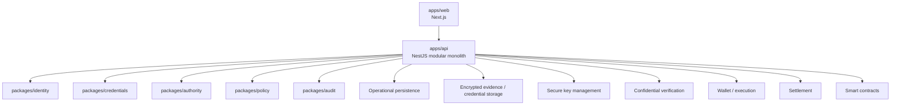

# Catenor One — Reference Architecture

> **Architecture baseline for the ETHOnline 2026 reference implementation.**

**Status:** Draft v0.1 — implementation baseline  
**Project:** Catenor One  
**Protocol:** Catenor Protocol Draft v0.1

---

## 1. Architectural decision

Catenor One uses:

> **Modular Monolith + Vertical Slices + DDD-lite + Clean Architecture boundaries.**

These solve different problems:

```text
Modular Monolith = deployment/runtime organization
Vertical Slices  = delivery and implementation sequencing
DDD-lite         = domain modeling and language
Clean Architecture = dependency direction and boundaries
```

The goal is hackathon speed without turning protocol rules into framework/vendor glue.

---

## 2. High-level system



Draft v0.1 starts with two deployables:

```text
apps/web
apps/api
```

No microservices initially.

---

## 3. Frontend

`apps/web` uses:

```text
Next.js App Router
TypeScript
Tailwind CSS
```

Recommended organization:

```text
apps/web/src/
├── app/
├── features/
│   ├── trust-anchor-admission/
│   ├── sponsor-authorization/
│   ├── agent-delegation/
│   ├── investor-identity/
│   ├── policy-decision/
│   ├── distribution/
│   └── audit/
├── components/
├── lib/
└── api/
```

The frontend never owns authoritative protocol authorization logic.

---

## 4. Backend

`apps/api` uses:

```text
NestJS
TypeScript
Modular Monolith
```

Recommended shape:

```text
apps/api/src/
├── main.ts
├── app.module.ts
├── modules/
│   ├── trust-anchor-admission/
│   ├── sponsor-authorization/
│   ├── agent-delegation/
│   ├── investor-identity/
│   ├── policy-decision/
│   ├── distribution/
│   └── audit/
└── infrastructure/
    ├── persistence/
    ├── key-management/
    ├── identity-providers/
    ├── confidential-compute/
    ├── credential-storage/
    ├── execution/
    └── settlement/
```

Controllers are thin delivery adapters:

```text
HTTP request
→ DTO validation
→ Application Use Case
→ HTTP response
```

Do not place domain rules, sponsor SDK orchestration, or direct persistence business logic in controllers.

---

## 5. Domain packages

```text
packages/
├── identity/
├── credentials/
├── authority/
├── policy/
├── audit/
└── sdk/
```

Domain packages MUST NOT directly depend on:

```text
NestJS
Prisma
HTTP controllers
Chainlink SDKs
Privy SDKs
Arc/Circle SDKs
cloud-storage SDKs
```

### identity
Owns Canonical Subject, `did:catenor`, DID Document, Verification Methods, Account Bindings, Subject Continuity semantics, key lifecycle semantics.

### credentials
Owns VC/VP domain model, proof semantics, credential verification, status abstractions, issuer references.

### authority
Owns Relationships, Capabilities, Delegation, Delegability, Authority Grants/Chains, Trust Anchors, Admission Records, Issuer Authority.

Critical invariants:

```text
Relationship != Capability
ISSUE_CREDENTIAL != AUTHORIZE_ISSUER
delegated authority ⊆ delegator authority
```

### policy
Owns Policy, Policy Evaluation, Decision, ALLOW/DENY semantics.

### audit
Owns Audit Event/history/explanation/commitment semantics, not storage technology.

### sdk
Future developer-facing composition API. Do not prematurely design a broad SDK before slices validate it.

---

## 6. DDD-lite

Use DDD pragmatically:

```text
ubiquitous language
value objects
entities
aggregates where meaningful
domain invariants
domain services
ports
repositories at meaningful persistence boundaries
```

Avoid ceremony without value:

```text
repository for every table
factory for every constructor
aggregate for every object
business rules scattered in framework services
```

Useful value objects may include:

```text
CatenorDid
VerificationMethodId
CredentialId
TrustDomainId
PolicyId
```

---

## 7. Clean Architecture dependency rule

Dependencies point inward:

```text
Delivery / Framework
        ↓
Application
        ↓
Domain

Infrastructure implements inward-defined ports.
```

Preferred backend pattern:

```text
Controller
→ Application Use Case
→ Domain
→ Ports
→ Infrastructure Adapters
```

Not the default architecture:

```text
Controller
→ giant Service
→ Repository
```

Repositories are ports at real domain persistence boundaries, not obligatory wrappers around every table.

---

## 8. Example application use case

S001 conceptually becomes:

```text
AdmitTrustAnchor
    ├── SubjectManager
    ├── AssertionSigner port
    ├── DidState port
    ├── EvidenceVerifier port
    ├── PolicyEvaluator
    ├── AdmissionRepository port
    └── AuditWriter port
```

Sequence:

```text
1. resolve/create Subject
2. create assertion key
3. publish DID state
4. prove key possession
5. verify private evidence
6. evaluate Admission Policy
7. create Decision
8. create Admission Record
9. activate Trust Anchor
10. write audit history
```

This is application orchestration, not controller logic.

---

## 9. Persistence baseline

Reference implementation baseline:

```text
PostgreSQL
Prisma
```

The operational database is an index/query layer, **not cryptographic truth**.

Logical storage boundaries:

```text
PUBLIC / RESOLVABLE DID STATE
PRIVATE OPERATIONAL STATE
ENCRYPTED EVIDENCE / CREDENTIAL STORAGE
SECURE KEY MANAGEMENT
AUDIT / HISTORY
```

### Public DID state
May include:

```text
did:catenor
DID Document
public Verification Methods
public status/lifecycle references where applicable
```

Draft v0.1 may resolve DID state via offchain persistence + resolver API. An onchain DID registry is not required merely because other parts use blockchain.

### Private operational state
May include:

```text
Canonical Subject records
provider mappings
private Account Bindings
Trust Domain membership/index
Credential references
Relationship/Capability indexes
Decision references
opaque signer references
```

### Encrypted object storage
May contain:

```text
full sensitive VCs
identity/organization evidence
signed archives
Admission evidence
historical private snapshots
```

---

## 10. Key management

Private keys are never general database fields.

Infrastructure exposes ports such as:

```ts
interface AssertionSigner {
  createKey(...): Promise<PublicKeyReference>;
  sign(...): Promise<Signature>;
}

interface ExecutionSigner {
  requestExecution(...): Promise<ExecutionResult>;
}
```

Hard invariant under the financial-security model:

```text
Credential Assertion Key != Financial Execution Key
```

---

## 11. Smart-contract philosophy

Use contracts only when onchain execution adds a meaningful property.

Potential later responsibilities:

```text
financial execution
distribution
token/offering execution
minimal decision/commitment references
audit commitments where useful
```

Never put raw PII, sensitive credentials, or private Account Bindings onchain.

Reference tooling:

```text
Solidity
Foundry
well-reviewed libraries where appropriate
```

Contracts are slice-driven. S001 does not require a contract by default.

---

## 12. Confidential workflows

```text
workflows/
├── credential-recertifier/
├── subject-continuity/
└── distribution/
```

Workflows implement infrastructure behavior; they do not own canonical domain semantics.

Example:

```text
Domain/Application port: ConfidentialEvidenceVerifier
Infrastructure implementation: Chainlink CRE workflow adapter
```

---

## 13. Sponsor integration boundaries

```text
Domain/Application
    ├── Confidential Verification Port
    │       ↓
    │   Chainlink CRE Adapter
    ├── Secure Wallet / Execution Port
    │       ↓
    │   Privy Adapter
    └── Settlement Port
            ↓
        Arc Adapter
```

Sponsor technology MUST NOT redefine Catenor domain semantics.

### Chainlink CRE
Infrastructure/workflow responsibility for confidential API access, sensitive evidence evaluation, credential re-certification, Subject Continuity, private Policy inputs, and distribution calculations.

An LLM MUST NOT make final deterministic KYC/AML/authority/eligibility decisions when protocol rules can decide them.

### Privy
Infrastructure responsibility for user wallets, organization wallets, agent wallets/signers, secure signing, policies, limits, approvals/quorum, execution authorization.

```text
Catenor Policy Decision != Privy Execution Authorization
```

### Arc
Settlement infrastructure for USDC/transaction execution. Arc does not define Catenor identity or authority semantics.

---

## 14. Official sponsor agents / skills

Before sponsor-specific implementation code is written:

```text
1. load current official sponsor agent/skill/docs
2. confirm current APIs and recommended patterns
3. implement the Catenor-defined port via an adapter
4. document AI/tool usage and dependency provenance
5. save judge-verifiable artifacts
```

Do not implement sponsor APIs from model memory when official current tooling is available.

Official integration agents may implement adapters. They may **not** redefine Catenor domain semantics.

Artifacts:

```text
artifacts/chainlink/
artifacts/privy/
artifacts/arc/
```

---

## 15. Vertical slices

Every substantial implementation capability maps to an approved slice.

Example:

```text
S001 Trust Anchor Admission
web
→ controller
→ use case
→ identity/authority/policy domain
→ ports
→ infrastructure adapters
→ persistence/confidential verification/audit
```

`SPEC.md` answers **what must be true**.  
`ARCHITECTURE.md` answers **what structure must be obeyed**.  
`PLAN.md` answers **how this slice fits the architecture**.

---

## 16. Testing strategy

### Domain unit tests
Framework-free tests for DID validation, Capability scope, Delegation subset rules, Issuer Authority, Policy evaluation.

### Application/use-case tests
Use fake/mock ports to verify orchestration and failure behavior.

### Infrastructure integration tests
Test persistence, signing/key management, confidential workflows, wallet adapters, settlement adapters.

### End-to-end slice tests
Validate approved acceptance criteria and negative paths across real boundaries where practical.

---

## 17. Disallowed dependencies

```text
packages/authority imports Privy SDK      ✗
packages/identity imports NestJS          ✗
packages/policy imports Prisma            ✗
domain calls HTTP directly                ✗
frontend decides authoritative ALLOW      ✗
```

---

## 18. Architecture review checklist for every slice PLAN

```text
Does it preserve the pinned protocol baseline?
Does domain code remain framework/vendor independent?
Is the slice vertically complete?
Are external systems behind ports/adapters?
Are public/private states separated?
Are keys purpose-separated?
Is DB state treated as index, not proof?
Are negative paths planned?
Are required sponsor official agents/skills identified?
Are judge-verifiable artifacts planned?
Can this slice be tested independently of future slices?
```

---

## 19. Baseline stack summary

```text
Frontend               → Next.js App Router + TypeScript
Backend                → NestJS Modular Monolith + TypeScript
Domain                 → packages/*, DDD-lite, framework-independent
Persistence            → PostgreSQL + Prisma
Sensitive storage      → encrypted object-storage / vault abstraction
Keys                    → secure key-management adapters
Confidential verification → Chainlink CRE adapter/workflows
Wallet execution       → Privy adapter
Settlement             → Arc adapter
Smart contracts        → Solidity + Foundry, slice-driven
Delivery               → Vertical Slices
Dependency model       → Clean Architecture boundaries
```

> **The protocol defines the rules. Domain packages encode the rules. Application use cases orchestrate them. Infrastructure adapters connect external systems. Vertical slices prove the whole thing works.**
